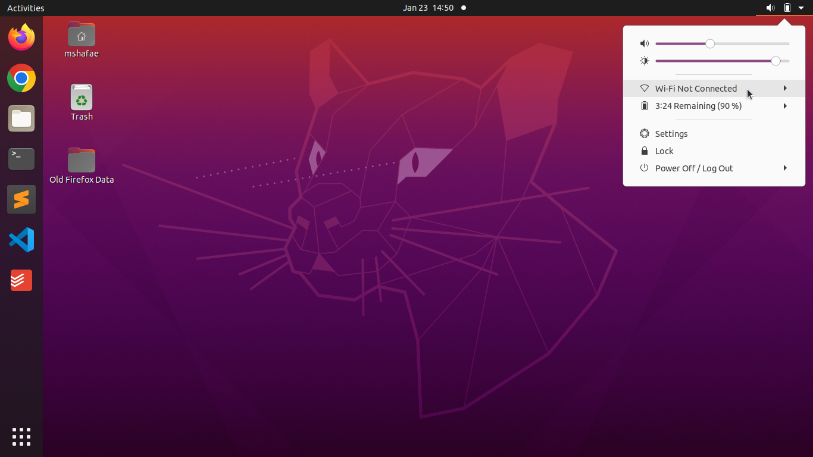
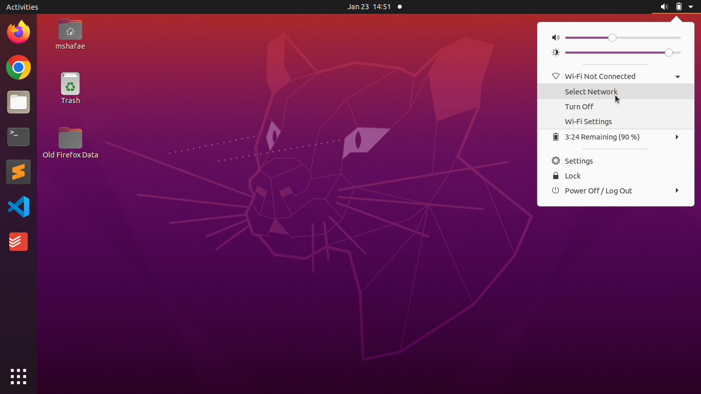
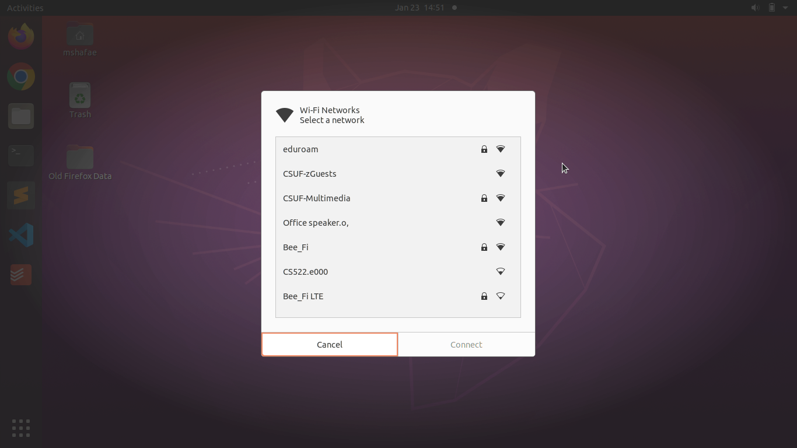
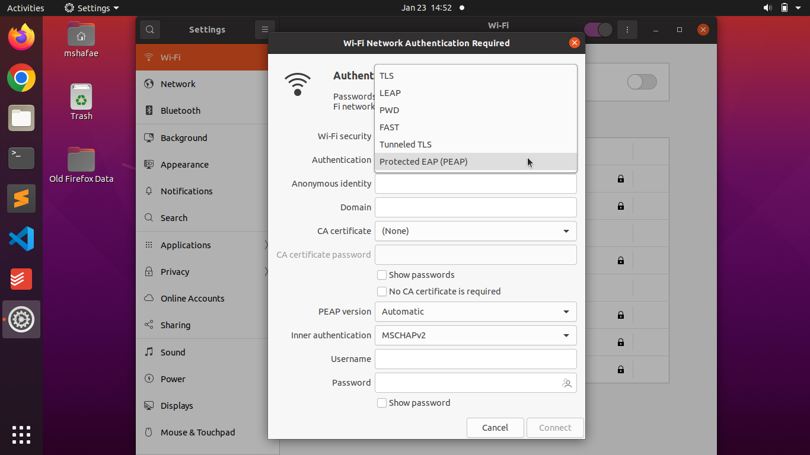
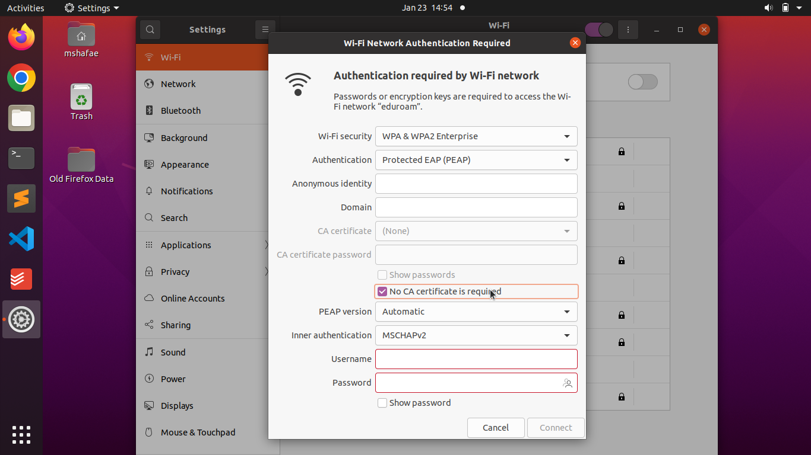
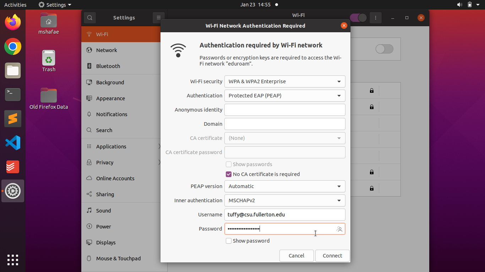
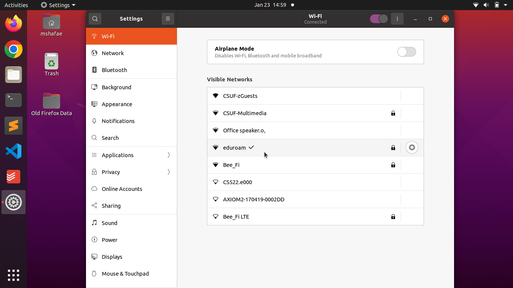

# Eduroam with Linux

The WiFi network at CSUF is named [eduroam](http://www.fullerton.edu/it/announcements/untitled.php). Eduroam is a [global collaboration](https://eduroam.org/) which gives you access to thousands of WiFi hotspots in hundreds of countries.

CSUF has WiFi access points in buildings and outdoors. View the campus' map of access points online at <a class="inline_disabled" href="https://wireless.fullerton.edu/map/" target="_blank" rel="noopener">https://wireless.fullerton.edu/map/</a>.

To use the eduroam WiFi network, you have to sign into it. Using Ubuntu 20 Linux as an example, you will find that connecting to it requires some changes to the defaults and it is easy to do.

## Connecting

To get started click on the battery and triangle icon in the upper right hand corner. A menu will appear showing that your computer is not connected to a WiFi network. If you do not see an option to connect to a WiFi network then your computer's WiFi hardware is not recognized by the operating system; tips for troubleshooting are at the end of this page.
    

Next, click on 'Wi-Fi Not Connect' and you will be given the option to 'Select Network'. Choose this option.

Clicking on 'Select Network' will open a new window showing the WiFi networks that can be heard from the WiFi antennas on your computer. Look for 'eduroam'. If it doesn't appear at first, you may have to wait a little bit for it to appear. The list of networks you see on your computer will be different than the one showed in the image below. What is important is identifying the network named 'eduroam'.

Once you have clicked on 'eduroam', a new window will open which will prompt you to enter connection information and your credentials (login and password). The screen will look identical to the one showed below.

The first step is to change 'Authentication'. The default is 'Tunneled TLS'. Change the value to 'Protected EAP (PEAP)' by clicking on the drop down menu and selecting it.

Once it is selected, the display will look like the following screenshot.

The next step is to click the box next to 'No CA certificate required'.

Next, enter your @csu.fullerton.edu email address as your 'Username' and your portal password as your 'Password'. Click the 'Show password' box to verify you have the correct password. Please do this step slowly and carefully to make sure you have entered your Username and Password correctly. Once you have verified your Username and Password, click the Connect button at the bottom right of the window.

After clicking 'Connect' the window will close and Ubuntu Linux will attempt to login to eduroam. If all the fields were correctly set and the correct username and password was given, you can expect to be logged into eduroam in a matter of seconds. The display will update showing a checkmark next to eduroam meaning that you have successfully connected.

## Troubleshooting

The most common problem is that you follow the steps and you do not connect to eduroam. The most likely problem is that you have entered your username and password incorrectly. Click on the gear to the right of eduroam and re-enter your information.

Double check your work and double check you have entered your full email address and you have entered your password correctly. If this fails a second time, reboot your computer and try it one more time. If it does not work after rebooting your computer, ask your instructor for help.

Another common problem is that you have a WiFi interface and Linux doesn't recognize it. This would mean that if you used the computer with Microsoft Windows, the WiFi works and when you installed Linux the WiFi does not exist. This means that your computer's WiFi uses drivers that Linux does not know about (yet).

There are many strategies to overcome the problem of missing drivers. The best solution that will cost you the least amount of trouble and time is to purchase an inexpensive USB WiFi dongle from a store. WiFi dongles made by companies such as TP-Link, Linksys, D-Link, Netgear, and others are often under $20 and will get you online quickly.

If you are unsure what to do, consult with an instructor what is the best course of action. Spending a few minutes asking your instructor what would work best can save you countless hours. Please share your computer's make and model to help your instructor know what kind of hardware you are using.
